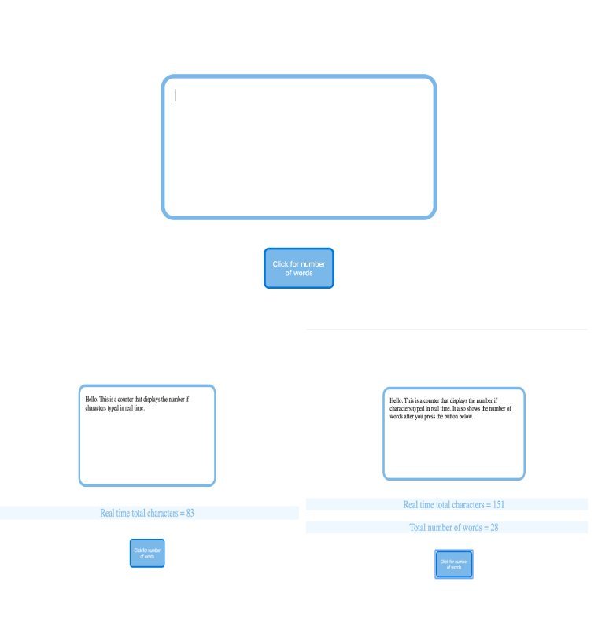

# Word-Character-counter-

Responsive voice API testings (3 different API calls) - one for normal responsive voice, one to rearange text as Yoda would say it and one to rearange the textas a pirate would say it. (bonus it shows number of characters and words).

There is also a welcome audio message with instruction on what to do.

Guide: 

Type the text in the big box in the middle. After you type the text press the button below to hear it with normal voice and get a new paragraph to shows how many words exactly you have typed.

On the left and right side there are 'Yoda' and 'pirate' button. Clicking them after you have typed the text will trigger audio of the text you have written in Yoda or pirate grammar (note: the sound of the voice is the same, only the grammar and phrasing is changed)

